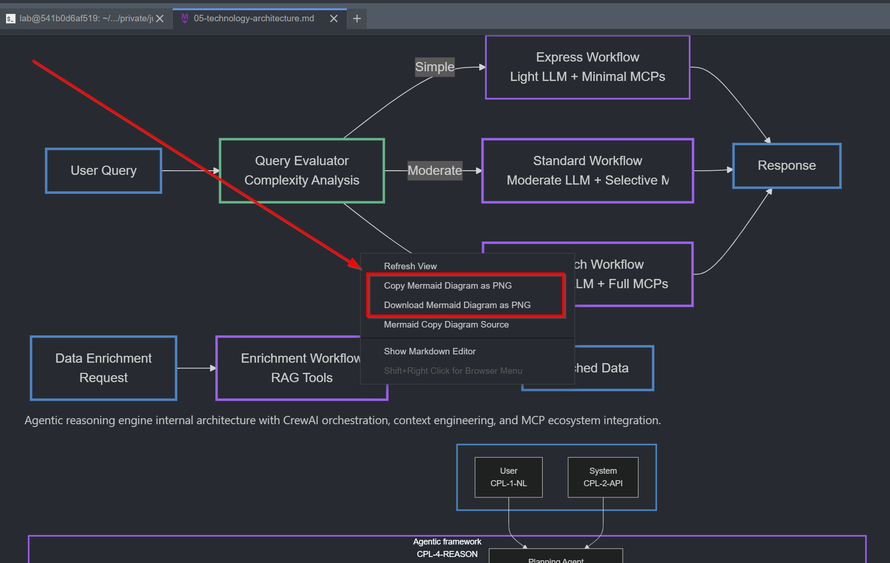

# JupyterLab Mermaid to PNG Extension

[](https://github.com/stellarshenson/jupyterlab_mmd_to_png_extension/actions/workflows/build.yml)
[](https://www.npmjs.com/package/jupyterlab_mmd_to_png_extension)
[](https://pypi.org/project/jupyterlab-mmd-to-png-extension/)
[](https://pepy.tech/project/jupyterlab-mmd-to-png-extension)
[](https://jupyterlab.readthedocs.io/en/stable/)
[](https://kolomolo.com)

Export Mermaid diagrams from JupyterLab markdown files as high-quality PNG images. Right-click any rendered diagram in the markdown viewer to copy or save it as a PNG file with configurable resolution settings.



## Features

**Core capabilities:**
- Copy diagrams directly to clipboard as PNG images
- Save diagrams as PNG files with deterministic content-based filenames
- Configurable DPI resolution from 72 to 1200 (default 300)
- Transparent backgrounds for seamless integration into documents
- Zero configuration required - works immediately after installation

**Technical implementation:**
- Pure client-side rendering using browser canvas API
- No external services or command-line tools required
- Calibrated DPI conversion matching Adobe converter output (±0.07% accuracy)
- Context menu integration in markdown viewer only

## Requirements

- JupyterLab >= 4.0.0

## Installation

Install from PyPI using pip:

```bash
pip install jupyterlab_mmd_to_png_extension
```

After installation, restart JupyterLab to activate the extension.

## Usage

Open any markdown file containing Mermaid diagrams in JupyterLab. The extension adds two options to the context menu when you right-click on a rendered diagram in the markdown viewer:

**Copy as PNG** - Copies the diagram to your clipboard as a PNG image. Paste directly into documents, presentations, or image editors.

**Save as PNG** - Downloads the diagram as a PNG file. Filenames follow the pattern `mermaid-<document-name>-<content-hash>.png` where the hash is generated from the diagram content, ensuring consistent filenames for identical diagrams.

### DPI Configuration

Adjust export resolution through JupyterLab's settings interface. Navigate to Settings -> Advanced Settings Editor -> Mermaid to PNG Extension. The default DPI is 300 (standard print quality), with a range from 72 (screen resolution) to 1200 (professional print quality).

## Example

Create a markdown file with a Mermaid diagram:

```markdown
```mermaid
graph TD
    A[Start] -> B[Process]
    B -> C[End]
```
```

Render the markdown file in JupyterLab's viewer. Right-click the diagram and select either "Copy as PNG" or "Save as PNG". The exported image will use your configured DPI setting and include a transparent background.

## Uninstall

Remove the extension using pip:

```bash
pip uninstall jupyterlab_mmd_to_png_extension
```

## Troubleshooting

If the extension is not appearing in the context menu, verify both the server and frontend extensions are properly installed and enabled.

Check server extension status:
```bash
jupyter server extension list
```

Check frontend extension status:
```bash
jupyter labextension list
```

Both should show `jupyterlab_mmd_to_png_extension` as enabled. If either is missing or disabled, reinstall the extension and restart JupyterLab.

## Contributing

### Development Setup

Install the extension in development mode. This requires NodeJS for building the TypeScript source code. The `jlpm` command is JupyterLab's pinned version of yarn.

```bash
# Install package in development mode
pip install -e ".[test]"

# Link development version with JupyterLab
jupyter labextension develop . --overwrite

# Enable server extension manually (required in development mode)
jupyter server extension enable jupyterlab_mmd_to_png_extension

# Build the extension
jlpm build
```

### Development Workflow

Run the watch command in one terminal to automatically rebuild on file changes:

```bash
jlpm watch
```

Run JupyterLab in a separate terminal:

```bash
jupyter lab
```

The extension rebuilds automatically when you save changes. Refresh your browser to load the updated extension (allow a few seconds for rebuild completion).

### Development Uninstall

Disable the server extension and remove the package:

```bash
jupyter server extension disable jupyterlab_mmd_to_png_extension
pip uninstall jupyterlab_mmd_to_png_extension
```

Remove the symlink created by `jupyter labextension develop`. Use `jupyter labextension list` to locate the `labextensions` folder, then delete the `jupyterlab_mmd_to_png_extension` symlink within that folder.

### Testing

**Python tests** use Pytest:
```bash
pip install -e ".[test]"
pytest -vv -r ap --cov jupyterlab_mmd_to_png_extension
```

**JavaScript tests** use Jest:
```bash
jlpm
jlpm test
```

**Integration tests** use Playwright with the Galata framework for JupyterLab UI testing. See [ui-tests/README.md](./ui-tests/README.md) for details.

### Release Process

See [RELEASE.md](RELEASE.md) for packaging and publishing instructions.
